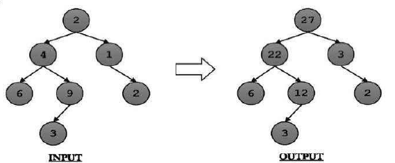
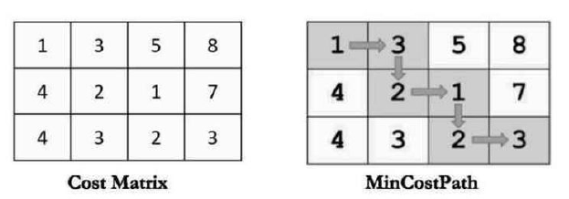
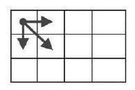

1. print 1 to n
2. sum of 1 to n given n.
3. sum of an array
4. convert an array such that a[i] = a[i] + sum of all elements before it
5. factorial using recursion
6. power of n
7. tower of hanoi
8. print a linked list
9. print a linked list in reverse
10. binary tree in order traversal
11. binary tree pre order traversal
12. bubble sort
13. mathematical table of n from 1 to 10
14. fibonacci using recursion
15. fibonacci using memozation
16. fibonacci using dp
17. There are N stations in a route, starting from 0 to N-1. A train moves from first station (0) to last station (N-1) in only forward direction. The cost of ticket between any two stations is given. Find the minimum cost of travel from station 0 to station N-1.
    1. Eg: cost[4][4] = {
       {0 , 10, 75, 94},
       {-1, -1, 35, 50},
       {-1, -1, 0, 80},
       {-1, -1, -1, 0}
       }
18. Given a matrix of order N\*N. What are the total number of ways in which we can move from top-lelft cell (arr[0][0]) to the bottom-right cell (arr[N-1][n-1], given thaat we can only move either downward or rightward).
19. Find length of longest substring of a given string of digits, such that sum of digits in the first half and second half of the substring is same. Solve this with brute force and then optimize with memoization. For example,
    1. Input : "142124"
    2. Output : 6
20. Write a program compute fibonacci(n) in log n time.
21. factorial using memoization
22. factorial using dp
23. pre order traversal of a binary tree
24. Given a binary tree, For each node, add sum of all the nodes in its hierarchy to its value.

25. In combinatorics, Combination is defined recursively. C(n, m) = C(n - 1, m) + C(n-1, m-1). Write a program to find this through Dynamic Programming and Recursion
26. Given a two-dimesnional square matrix cost[][] of order M\*N where cost[i][j] represents the cost of passing through cell(i,j). Total cost to reach a particular cell is the sum of costs of all the cell in that path (including the starting and final cell). We can only move either downward or rightward i.e If we are at cell (i,j) the we can either go to the cell (i, j+1) or to (i+1, j).

27. Same as above problem but diagonal move is allowed. i.e (i+1, j+1)

28. Given an empty plot of size 2 * n. we can to place tiles such that entire plot is covered. Each tile is size 2 * 1 and can be place either horizontally or vertically. If n is 5, then one way to cover the plot

29. If size of the plot in previous example is changed to 3 * n, then what changes do we need to make in the solution above. The below picture shows one of the possible arrangements on a plot of size 3 * n where n = 12.

30. Consider a game where a player can score 3, 5, or 10 points in one move. Given a total score N, find the total number of unique ways to reach a score of N.
For example: If N = 13, out should be 5 because there are 5 ways to reach to a score of 13 as shown below. (3, 10), (3, 5, 5) (5, 5, 3) (10, 3)
31. What is the total number of ways to reach a particular score if (10, 3) and (3, 10) are considered same. Modify your function accordingly.
32. Given an array of integers, write a function that returns the maximum sum of sub array, such that elements are contiguous.
Input Array: {-2, -3, 4, -1, -2, 1, 5, -3}
Output: 7
(-2, -3, **4, -1, -2, 1, 5, -3**)